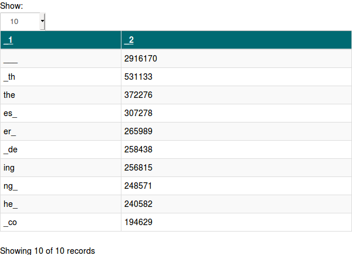
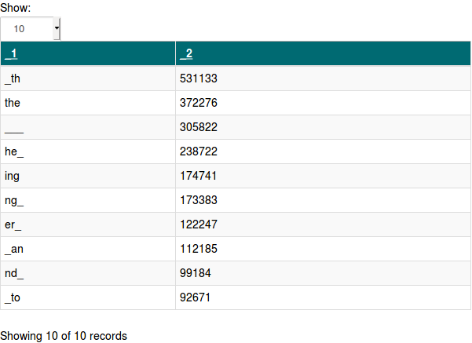
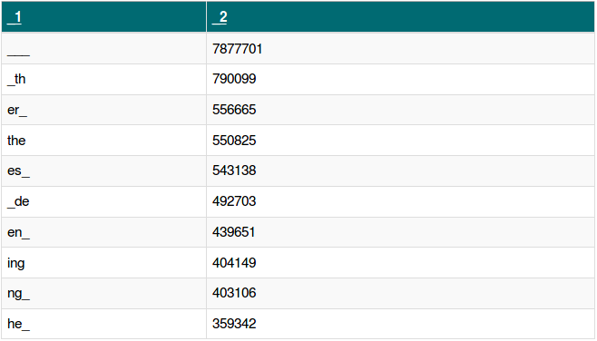
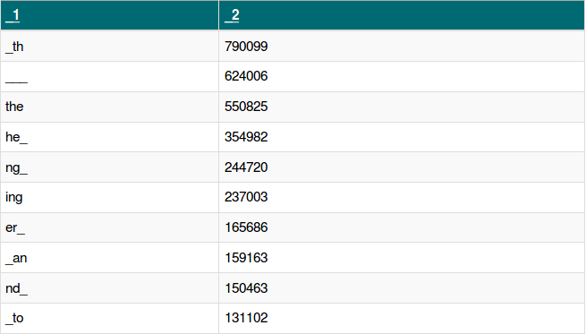

#Detecting English Language On The Internet

## Table of Contents
1. [Working with WARC files in Spark](#)
2. [Exploring CDX Index Service](#)
3. [Loading the WARC file into the notebook](#)
4. [English vs Non-english](#)
5. [Detecting English Language using 3-grams](#)
6. [Results](#Results)
7. [Concluions](#)
8. [Working with the standalone program spark program](#)

##Exploring CDX Index Service
The last assignment for the 2018-2019 Bigdata course consists of an open assignment, where we download a large warc file and submit a standalone Spark application. For this, I made use of the CDX Index Service, which provide WARC files.

For the first part of the assignment, I worked with a Spark notebook provided by the course. In the notebook, I familiarized myself with warc files and how to parse them. This was very helpful, as I still had trouble with scala syntax and the notebook provided an interactive way for me to write and test code. 

The part of the code which was already written inside the notebook included imports to external libraries to parse WARC files (by SurfSara) and how to read headers and contents of the documents in the WARC files. Custom classes were already written to parse the contents of the files.

During the first week, I encountered a problem with the WARC files. I tried downloading multiple WARC files from the CDX index service but found that all documents contained within the downloaded WARC files gave 300-500 error responses. This is a problem, since I would like to do something with the contents of the documents. Later on, I realized the warc files I downloaded were labeled as status "301", which meant they contained only documents which gave error responses. This problem was quickly solved by downloading a WARC file with status "200".

##Loading the WARC file into the notebook
This was the easy part, since the code was given. The data is loaded using the surfsara class WarcInputFormat. Below is the code:
		
	val warcfile = "/opt/docker/notebooks/BigData/CC-MAIN-20190526045109-20190526071109-00464.warc.gz"
	val warcf = sc.newAPIHadoopFile(
              warcfile,
              classOf[WarcInputFormat],               // InputFormat
              classOf[LongWritable],                  // Key
              classOf[WarcRecord]                     // Value
    )

##English vs non-english
Upon inspecting the contents of the WARC file, I noticed that the latest WARC file I downloaded contained a lot of non-english documents. To solve this issue, I filtered the RDD's containing the documents by domain (only allowing .com). However, commercial domains themselves contain a lot of non-english content and vice versa, thus I started to think about ways in which I could filter them. I tried using the Pattern class:

	import java.util.regex.Pattern;
	import java.util.regex.Matcher;

and regular expressions such as:

	"(?<=\s|^)[a-zA-Z]*(?=[.,;:]?\s|$)" and "^[a-zA-Z]*$"
Which filters the documents based on the alphabetic content. However, the documents were filtered down to just 75 english documents out of the 142450 documents, which I was sure was not possible. I soon looked for other ways to  try to filter out the english documents. 

##Detecting English Language using 3-grams
After failing to filter the documents using Patterns and regex, I started wondering what the best way to detect english would be. After some googling, I found that using n-grams is an effective way. Using this website:[English Letter Frequencies](http://practicalcryptography.com/cryptanalysis/letter-frequencies-various-languages/english-letter-frequencies/) I found the most common n-grams for the english language. Here, we can see that the biggest differences in frequencies occur in the monogram, bigram and trigram department and that the most common english word is "the".

Using this [Stackoverflow question on how to extract n-grams in Spark](https://stackoverflow.com/questions/34998952/how-to-extract-character-n-grams-based-on-a-large-text), I started extracting n-grams from the documents. First, I replaced all non-alphabetic characters with an underscore. This is because I was not interested in characters from asian countries, special characters or special encoding characters. Then, I replaced all white spaces by underscores aswell. Below my Scala code to generate the n-grams:

	val ngrams=warcc.map(tt=>(tt._1,StringUtils.substring(tt._2, 0, 128),
                          (tt._2.replaceAll("[^a-zA-Z ']","").replaceAll(" ","_").toLowerCase().sliding(3).toList)
                          .groupBy(identity).mapValues(_.size).toSeq.sortBy(_._2).reverse.take(10)))
		.filter{!_._2.isEmpty }
		.filter{_._2.length>10}
		.filter{!_._3.isEmpty }
		.filter{_._3.unzip._1.toList.toString().contains("th")}
		.cache()

	ngrams.flatMap(tt=>tt._3).reduceByKey(_+_).sortBy(_._2,false).take(10)
First, an RDD is created containing URL on the first column, content substring on the second and the filtered content on the third column. Next, I filtered the second column so that it would contain at least 10 words. This seemed like a good threshold, as it would filter out websites which only contain an error message such as "a 404 error occurred". The last transformation and action creates a list containing the top10 3-grams and their counts.  

At this point, I wondered if the bigram "th" would be a good way to get english documents. Thus, I created 2 different RDD's to test this out using above code but without the line: 

	.filter{_._3.unzip._1.toList.toString().contains("th")}

##Results

In total, there were 142450 initial documents, 23873 documents contained the .com domain, 23400 of the .com domains were non-empty. 10645 of these documents were returned when filtering on the "th" bigram and had content, 46752 documents were returned when not filtering on the .com domain and not filtering with the "th" term

Table 1 shows the frequencies of the n-grams.

**Table 1.**top 10 3-gram frequencies for all files filtered on .com domain.

As shown in table 1, "___" is the n-gram with highest frequency. This is because most of the documents in the WARC file contain non-alphabetic characters (thus also non-english). Next, I filtered the files to contain either "th" or "the" in their top10 3-gram frequencies.

**Table 2.**top 10 3-gram frequencies for files with top10 frequencies containing "th" filtered on .com domain.

As we can see, most of the n-grams in top10 of table 1 and table 2 are the same. However, the count of documents in each RDD is different: out of the 23400 documents with .com domain, 6912 documents had "th" in their top10 3-grams.

**Table 3.** top 10 3-grams frequencies including non-.com domain

**Table 4.** top 10 3-grams frequencies including non-.com domain with "th" filter

In total, there were 46752 documents in the WARC file which had content with more than 10 words. The results of including all domains is depicted in table 3 and table 4. 

##Conclusions

Comparing the n-grams generated with the code vs the top n-grams found in this link: [English Letter Frequencies](http://practicalcryptography.com/cryptanalysis/letter-frequencies-various-languages/english-letter-frequencies/), we can see that most bigrams and trigrams in the top10 of all .com files are also found in the top 30 bigrams and trigrams from the link ("_co" and "_de" from table 1 for example is not found in the top 30 bigrams from the link). However, when filtering the documents to contain "th" and "the" in their top10 3-grams, all 3-grams (except "___") are found in the top 30 most common bi and trigrams from the link. This does indicate that filtering the documents for their top10 3-grams helps in detecting the english language.

Furthermore, filtering all the documents (including the non-.com domain) on the bigram "th", the frequency of "___" is reduced from 7.877.701 to 624.006. This means that the number of documents which contained non-alphabetic characters and special characters were mostly filtered out, which is likely to leave us with alphabetic character documents.

Moreover, when taking all documents, the result is also a top10 3-grams that contains top english 3-grams. The top english n-grams occur much more frequently. This does indicate that filtering on the .com domain is not a reliable strategy, as opposed to my previous point, to get english documents.

For future research, I would like to apply machine learning algorithms to detect english language in documents using Spark ML library. Moreover, I would like to implement tf-idf to extract more information out of the WARC files. However, due to time limitations I did not manage to get to these points. 

##Working with the standalone spark program

For this assignment, we had to write code in scala which could be submitted to a cluster. This was much different from the notebooks. In the notebooks, I could write code and test it immediately. However, the standalone spark program had to be sent to the cluster, which came with latency problems and startup time problems. 

At first, I tried to copy the code from the notebooks to the standalone program. However, very quickly I received error messages telling me that types were not valid. The Jsoup classes also had to be imported inside the build.sbt file, which i realized after getting an error telling me that Jsoup could not be imported and googling the solution. I have also had a lot of trouble with sequences, lists and  the reduceByKey operation. The network kept denying the job, but when I sampled only a part of the WARC file, it worked and gave a result. I speculate that memory was the issue, which is my next point. 

Upon looking at the workers, it seemed like their memory capped at 1024MB, which is not much. I have looked at the issue made on the BigData forums at [this link](https://github.com/rubigdata/forum-2019/issues/7). I have also tried to fix the issue with the stackoverflow post over at this [stackoverflow link](https://stackoverflow.com/questions/26562033/how-to-set-apache-spark-executor-memory/26578005#26578005) but did not solve the issue due ot my own knowledge limitations. 

Thus, in the standalone program, I took a sample from the WARC files. This was my biggest issue, as this means that the data is effectively no longer big. Because of this issue, I felt like it was useless to copy the code from the notebook to the standalone program, as the data would be useless for analysis. 

Moreover, I felt like I did not have enough time to test all the code in the notebook in the standalone program. With job startup time and type issues, I felt like it would be better to have a running standalone program, which is a bit less complete rather than one that is complete but full of errors. 

For every error, there was 1 minute for job build, as opposed to the notebooks, where simply shift+enter would immediately run the code. This meant that after every error, I had to look for the error, fix it and wait 1 minute, which would put me out of my programming focus. Sometimes I did not know how to fix an error, so I simply tried to write the code in a different way and hope it would work, which made things extremely time consuming.

In the future, I would like to understand why the notebook and the standalone application were working differently for my case. When I worked with the notebook, It seemed like everything was going well and there were almost no problems syntax wise or with type errors. However, upon switching, I had to deal with many errors. 